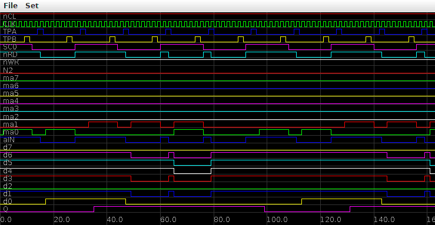

# PlotLogic
Simple Plotter for Digital Waveforms

---
This program is designed to plot a simple logic file format.

The first line of the file should be a list of space separated names.
Every line after that should be a list of space separated values (0 or 1).

For example, this is part of the Actual_1802_7A_7B_30_00.txt file:

    nCL CLK TPA TPB SC0 nRD nWR N2 ma7
    1 0 0 0 1 1 1 0 0
    1 1 0 0 1 1 1 0 0
    1 0 0 0 1 1 1 0 0
    1 1 0 0 1 1 1 0 0
    1 0 0 0 1 1 1 0 0
    1 1 0 0 1 1 1 0 0
    1 0 0 0 1 1 1 0 0
    1 1 0 0 1 1 1 0 0
    1 0 0 0 1 1 1 0 0
    1 1 0 1 1 1 1 0 0
    1 0 0 1 1 1 1 0 0
    1 1 0 0 1 1 1 0 0
    1 0 0 0 0 1 1 0 0
    1 1 0 0 0 1 1 0 0
    1 0 1 0 0 1 1 0 0
    1 1 1 0 0 0 1 0 0
    1 0 0 0 0 0 1 0 0
    1 1 0 0 0 0 1 0 0

